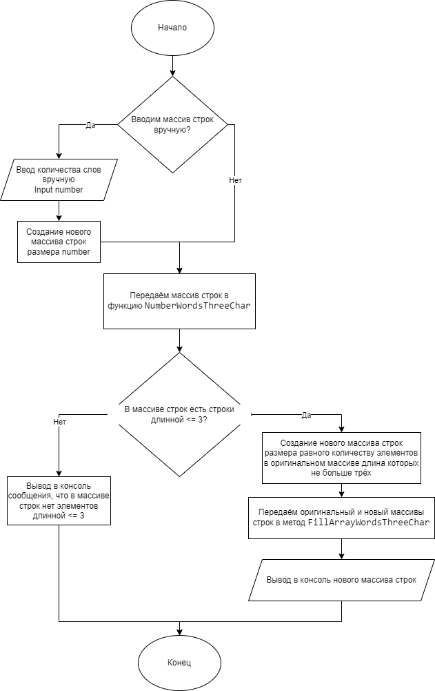
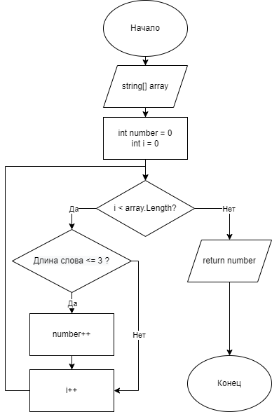
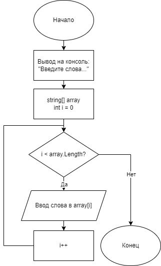
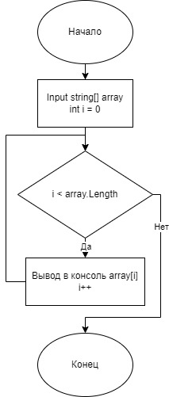

# GB-Control-First-Quarter

### Репозиторий для контрольной работы в GeekBrains

Первая четверть

Name: Mishchenko Nikita

email: NikMishchenko@yandex.ru

## Задача

Написать программу, которая из имеющегося массива строк формирует массив из строк, длина которых меньше либо равна 3 символа. Первоначальный массив можно ввести с клавиатуры, либо задать на старте выполнения алгоритма. При решении не рекомендуется пользоваться коллекциями, лучше обойтись исключительно массивами.

## Описание решения
По условию задачи, нужно из имеющегося массива строк, сформировать новый массив строк с длинной элементов не больше трёх символов. Первоначальынй массив может быть как подготовленным, так и введён вручную с клавиатуры. В данном решении программа спрашивает пользователя, хочет ли он ввести массив строк вручную, или же воспользоваться подготовленным масивом строк.

При выборе первого варианта программа спрашивает сколько будет слов-элементов в массиве. Это нужно для того, чтобы создать массив строк необходимой длины.

Получив размер массива, создаётся массив строк и передаётся в метод __ManualInputArray__. В данном методе, на каждом проходе цикла программа опрашивает пользователя для ввода элемента массива. После завершения работы данного метода, получается Первоначальный массив данных.

При выборе второго варианта, Первоначальный массив строк задан и заполнен тестовыми данными.

Дальше, независимо от выбора первого или второго варианта, программа обращается к функции __NumberWordsThreeChar__. Эта функция принимает Первоначальный массив и считает все элементы массива, длина которых меньше либо равна трём. Если функция возвращает ноль, программа выводит на консоль сообщение, что в Первоначальном массиве строк нет элементов нужной длины.

Вернув значение отличное от нуля, программа создаёт ещё один массив строк, равный длине этого значения.

Далее программа обращается к методу __FillArrayWordsThreeChar__ и передаёт в него два массива строк, Первоначальный и новый, в который она поместит все элементы из первоначального массива строк с длиной меньше или равной трём.

В завершении, программа обращается к методу __PrintArray__, который принимает на вход массив, и выводи его на экран. В данном случае, программа выводит в консоль сформированный массив из строк длина элементов в котором меньше или равна трём.

## Блок-схемы алгоритма и методов
### Main algorithm

### Метод FillArrayWordsThreeChar

### Функция NumberWordsThreeChar

### Метод ManualInputArray

### Метод PrintArray
