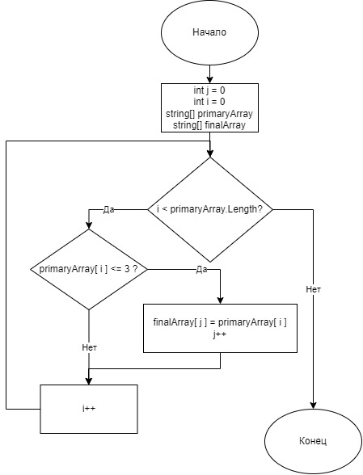

# GB-Control-First-Quarter

### Репозиторий для контрольной работы в GeekBrains

Первая четверть

Name: Mishchenko Nikita

email: NikMishchenko@yandex.ru

## Задача

Написать программу, которая из имеющегося массива строк формирует массив из строк, длина которых меньше либо равна 3 символа. Первоначальный массив можно ввести с клавиатуры, либо задать на старте выполнения алгоритма. При решении не рекомендуется пользоваться коллекциями, лучше обойтись исключительно массивами.

## Блок-схемы алгоритма и методов
Блок схемы работают на GitHub.
### Main algorithm

### FillArrayWordsThreeChar

### NumberWordsThreeChar
